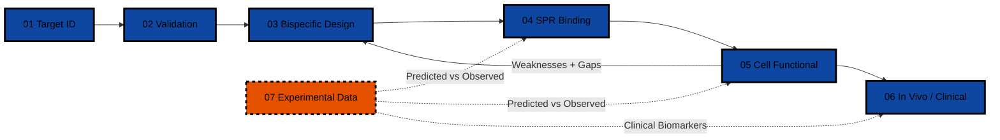
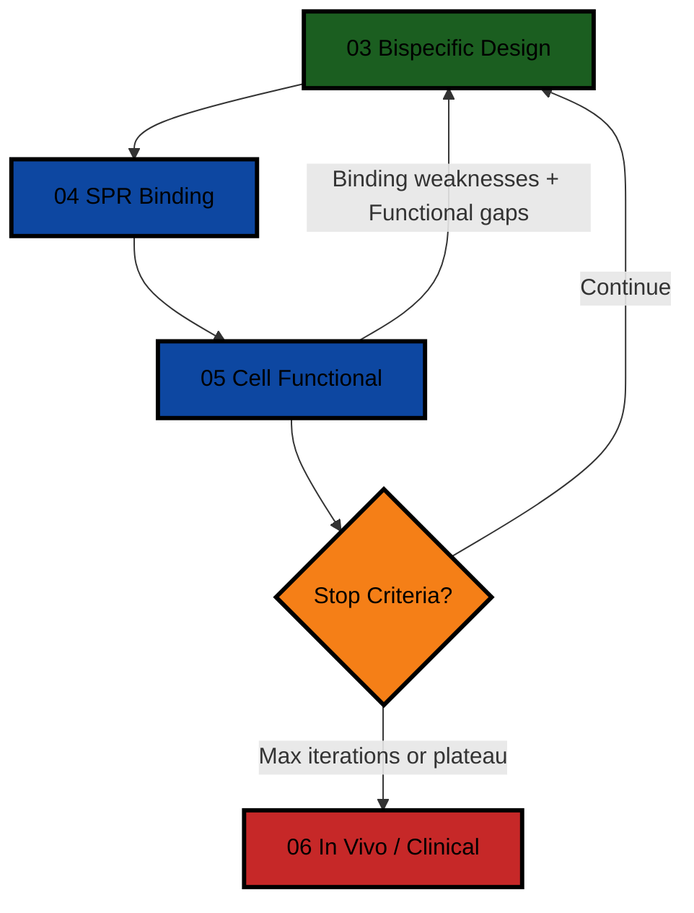
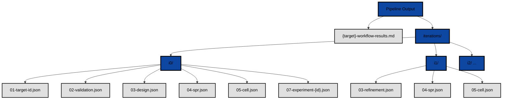

# Drug Discovery AI Agent Workflow — Bispecific Antibodies

A modular, reproducible workflow of AI agents for computational drug discovery. Each agent handles one stage of the drug discovery pipeline. Copy the folder, swap your target, and run.

---

## Architecture

```
drug-discovery-bispecific-agents/
├── orchestrator/             # Master prompt — coordinates 7 agents in sequence
├── agents/
│   ├── 01-target-id/         # Target identification from disease indication
│   ├── 02-target-validation/ # Genetic, functional, and clinical validation
│   ├── 03-bispecific-design/ # Molecule design, format selection, structural analysis
│   │   ├── prompt.md         # Initial design (iteration 0)
│   │   └── refinement-prompt.md  # REFINEMENT: redesign based on binding/functional data
│   ├── 04-spr-binding/       # Biochemical binding data analysis (SPR, BLI, ELISA)
│   ├── 05-cell-functional/   # Cell-based assay binding and functional data
│   ├── 06-in-vivo/           # In vivo functional and clinical data synthesis
│   └── 07-experimental-data/ # Wet lab experimental data ingestion
├── knowledge/                # Reference materials, public databases, domain context
└── output/                   # Generated pipeline results
```

## Pipeline Sequence



Each agent outputs both:
1. A markdown report (human-readable)
2. A structured JSON block (machine-readable) with a defined schema

The JSON format enables:
- **Iterative refinement:** Binding (04) and functional (05) weaknesses are piped back to the design agent (03), which proposes improvements. Then binding and functional are re-evaluated
- **Quantitative comparison:** Diff binding affinities, functional EC50s, and safety profiles across iterations
- **Programmatic orchestration:** JSON handoffs can be parsed by an orchestrator script
- **Traceable history:** All iteration outputs are versioned, making improvements easy to audit

### Iterative Refinement Loop



The refinement prompt (`agents/03-bispecific-design/refinement-prompt.md`) receives binding and functional weaknesses and proposes targeted fixes: affinity maturation, format switching, valency adjustment, Fc engineering, epitope shifts, or linker optimization. Stop criteria: 3 iterations max, improvement plateau (<10% delta), or agent flags that the format cannot be salvaged.

## Quick Start

### Using the Python Runner (recommended)

```bash
pip install openai
export OPENAI_API_KEY=sk-...
python run_pipeline.py PDCD1 VEGFA "solid tumor immunotherapy"
```

The runner reads all agent prompts, substitutes your target pair and disease, calls the LLM API for each agent, and saves output to `output/{target-slug}-workflow-results.md` and per-iteration JSON files in `output/iterations/`.

### Manual (step-by-step)

Each module is a standalone prompt. Run them sequentially, passing output from each into the next.

Using any LLM with web search, copy each `prompt.md` and run it. Each prompt is self-contained with instructions, data sources, and expected output format.

### Using a Task-Based LLM

Load the `drug-discovery-orchestrator` skill and run the full pipeline:

```
Run the full drug discovery pipeline for your bispecific antibody target pair
```

The orchestrator handles all modules, the refinement loop, and final synthesis automatically.

### Using LangChain/LangGraph

Map each module folder to a LangChain agent node. The `orchestrator/prompt.md` defines the graph edges. See `knowledge/public-databases.md` for API endpoints.

## Module Summary

| Module | Role | Key Data Sources | Output |
|---|---|---|---|
| 01 Target ID | Disease → candidate targets | Open Targets, DisGeNET, GWAS Catalog | Markdown + JSON |
| 02 Validation | Genetic + functional evidence | ClinVar, gnomAD, UniProt, ClinGen, PubMed | Markdown + JSON |
| 03 Bispecific Design | Format, structure, developability | PDB, SAbDab, Thera-SAbDab, AlphaFold DB | Markdown + JSON |
| 03 Refinement | Data-driven redesign (iterative) | Binding JSON (04) + Functional JSON (05) + Experimental JSON (07) | Markdown + JSON |
| 04 SPR Binding | Kinetic/affinity data analysis + predicted vs observed | ChEMBL, BindingDB, PubChem, Module 07 | Markdown + JSON |
| 05 Cell Functional | Cell-based functional data + predicted vs observed | PubMed, PMC, Module 07 | Markdown + JSON |
| 06 In Vivo | In vivo efficacy, clinical synthesis, safety | ClinicalTrials.gov, PubMed, PMC | Markdown + JSON |
| 07 Experimental Data | Ingest wet lab results, structured metadata | SPR instruments, ELISA readers, in vivo study reports | Markdown + JSON |

## Output Structure



## Requirements

- Any LLM with web search capability (Tavily, web fetch)
- No proprietary data required. All sources are public
- For automated runs: `pip install openai` and set `OPENAI_API_KEY`

## Why This Matters

This pipeline is not a literature review tool. It mirrors how a real drug discovery team operates:

1. **Design a molecule** → predict its binding and function
2. **Run experiments** → get real SPR, cell, and in vivo data
3. **Compare predicted vs observed** → identify where the model was wrong
4. **Redesign** → fix the weak points, iterate until improvement plateaus
5. **Make a Go/No-Go decision** → with full traceability from target ID through clinical synthesis

The key differentiator is Module 07 (Experimental Data Ingestion). Most AI drug discovery workflows only read public databases. This pipeline ingests wet lab results, validates them (N, SD, controls), compares them against computational predictions, and feeds discrepancies back into the refinement loop. This is how real platforms like Insilico Medicine's Pharma.AI operate — not just literature synthesis, but the full design-build-test-learn cycle.

## Disclaimer

All data sourced from published public databases and peer-reviewed literature. No proprietary or internal company data is used. This is a demonstration of AI-assisted drug discovery workflow automation.

## What This Pipeline Produces

For any bispecific antibody target pair, the pipeline generates:

- Target identification and disease association rankings
- Genetic, functional, and pharmacological validation
- Format selection and structural analysis
- Published SPR/BLI binding data comparison
- Cell-based functional data from clinical candidates
- Clinical trial field and competitive analysis
- Iterative refinement with quantitative comparison across iterations

A worked PD-1 × VEGF analysis citing public data is available in the [output folder](https://github.com/peterydkim/drug-discovery-bispecific-agents/tree/main/output) for reference.

## License

MIT — use freely. Attribution appreciated.
